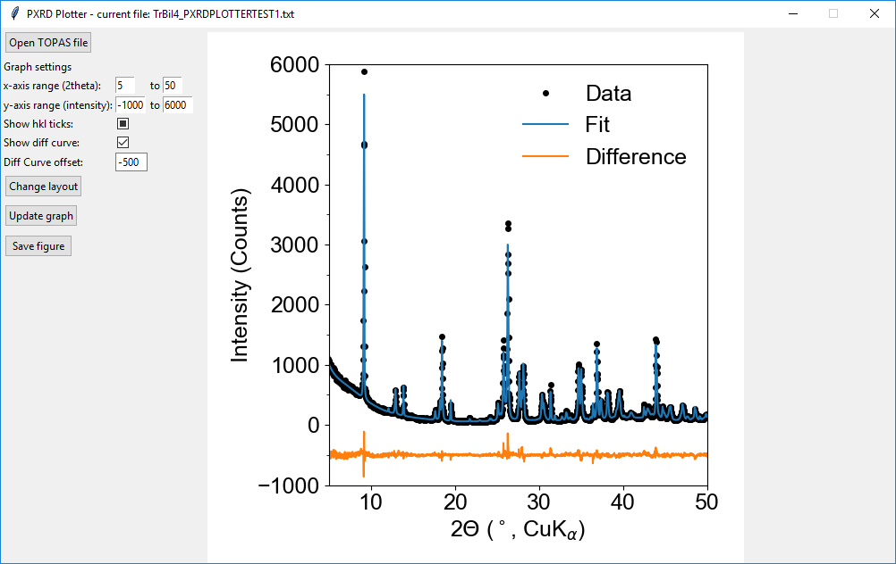

# PXRD-Plotter
A simple piece of software that makes graphing of Powder X-ray Diffraction Reitveld refinement data quick and easy.

Powder diffraction data can be difficult to accurately and elegantly display. This is especially true when attempting to plot all apsects of a Reitveld refined dataset, such as the difference curve, experimental data + fit data, and then hkl tick marks to indicate locations of expected Bragg reflections. This highly specific way of showing data makes plotting PXRD data time consuming and frustrating using typical graphing software.

PXRD-Plotter was made specifially to alleviate the afformentioned difficulties of graphing PXRD data in a simple and aestetically pleasing manner. It is written in Python 3 using TKinter to generate the GUI and graphical elements generated using the MatPlotLib package.

Example of a Reitveld refinement dataset plotted:

<b>How to use:</b>

<b>Loading in data</b>
1. Complete a Reitveld refinement in TOPAS to your liking. 
2. Right click the data set you want to export, and select "Export diff, I,"; save as a .txt file. do not modify this file.
3. (optional) to also load in hkl ticks: go to the refined model you want hkl ticks for. click "hkl_ls". highlight the "2theta" column, right-click and select "copy all", and paste into a text file and save as a .txt.
4. Open PXRD-Plotter and click "load TOPAS file". Navigate to the unmodified exported TOPAS .txt file you generated and open. The graph will immediately be populated with the data.
5. (optional) Click "load hkl ticks" to load in hkl ticks. Navigate to the .txt file you saved the hkl ticks in and open. the graph will automatically populate the ticks. This step can be repeated if multiple hkl tick files are necessary, such as when multiple phases exist.

<b>Tweaking your graph</b>

<b>Note: Any changes require clicking the "update graph" button.</b>

1. To modify x or y range, simply specify the values you want in the entry boxes provided. 
2. To disable the difference curve, check "disable difference curve"
3. To move the difference curve (to avoid having too much whitespace or overlapping with the data curve), specify a value in the entry box. Use negative values to move the curve lower.
4. To set one of the 3 specific template layouts, click "choose layout" button and select the type desired. 

<b>Saving your graph as an image</b>
1. Click "save graph" button. Currently supports exporting as .png file.
2. Figure will be trimmed to make sure there is no extra whitespace on the margins.

<b>misc notes:</b>

File format that are currently accepted are text files containing unmodified TOPAS exported data (for difference, data, and fit curves), and then hkl-containing text files.

Future modifications features: allow multiple graphs, export as pdf or eps, modify major/minor ticks, the different layouts
